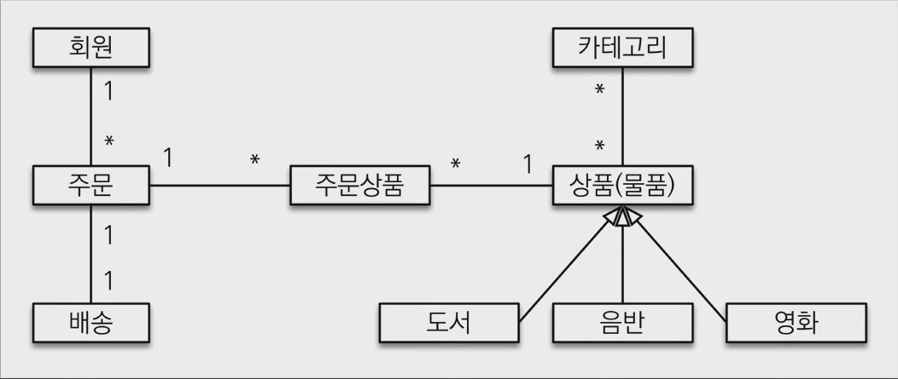
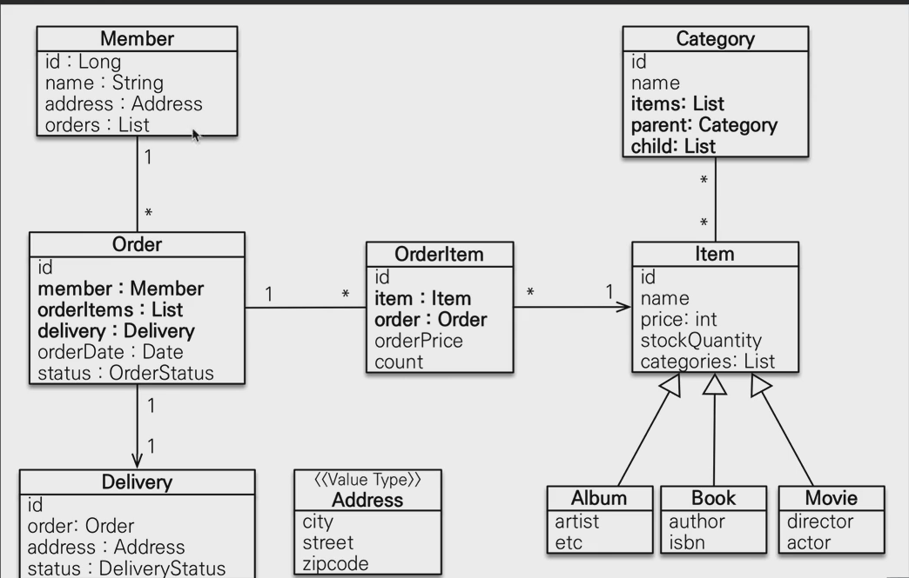
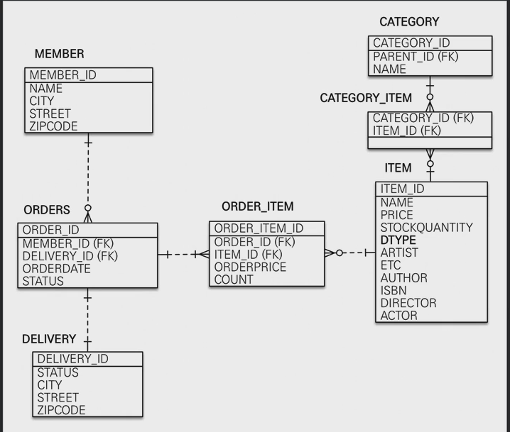

# 도메인 
> 기능목록
- 회원 기능
  - 회원 등록  
  - 회원 조회
- 상품 기능
  - 상품 등록
  - 상품 수정
  - 상품 조회
- 주문 기능
  - 상품 주문
  - 주문 내역 조회
  - 주문 취소
- 기타 요구사항
  - 상품은 재고 관리가 필요
  - 상품의 종류는 도서, 음반, 영화
  - 상품은 카테고리로 관리
  - 상품 주문 시 배송 정보를 입력

> DOMAIN MAPPING RELATION

> ENTITY Position Mapping RELATION
 

> SCHEMA

# API

- API 개발 고급 - 조회용 샘플 데이터 입력
- API 개발 고급 - 지연로딩과 조회 성능 최적화
- API 개발 고급 - 컬렉션 조회 최적화
- API 개발 고급 - 페이징 한계 돌파
- API 개발 고급 - OSIV(open session in view) 와 성능 최적화

# 권장 - query
- 엔티티 조회 방식으로 우선 접근
  - 패치조인으로 쿼리 수 최적화
  - 컬렉션 최적화
    - 페이징 필요 `default_batch_fetch_size: 100 ~ 1000, order_inserts: true, order_updates: true`
    - 페이징 필요x -> 패치 조인 사용
- 엔티티 조회 방식으로 해결이 안되면 DTO 조회 방식 사용
- jdbc 방식 => DTO 조회 방식으로 해결이 안되면 NativeSQL or 스프링 jdbcTemplate